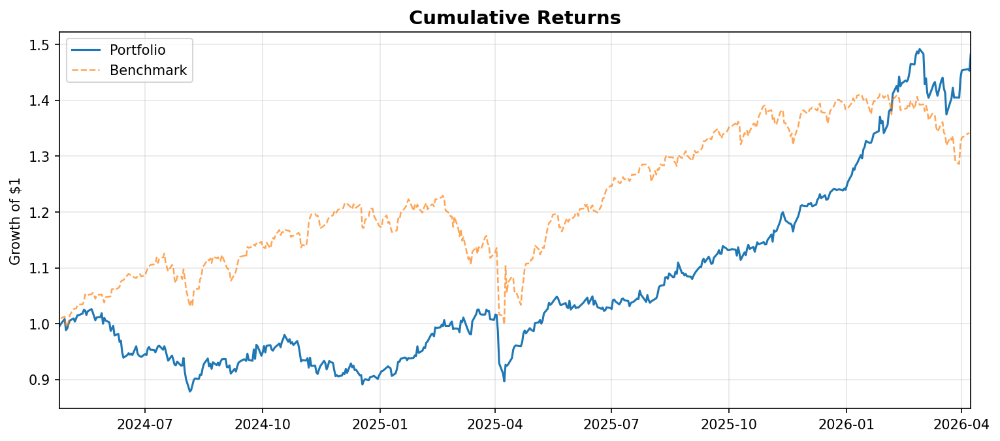
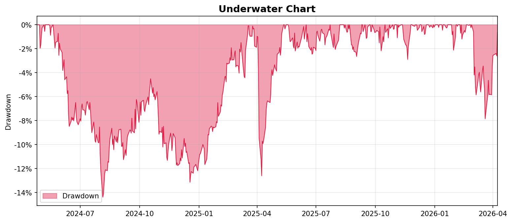
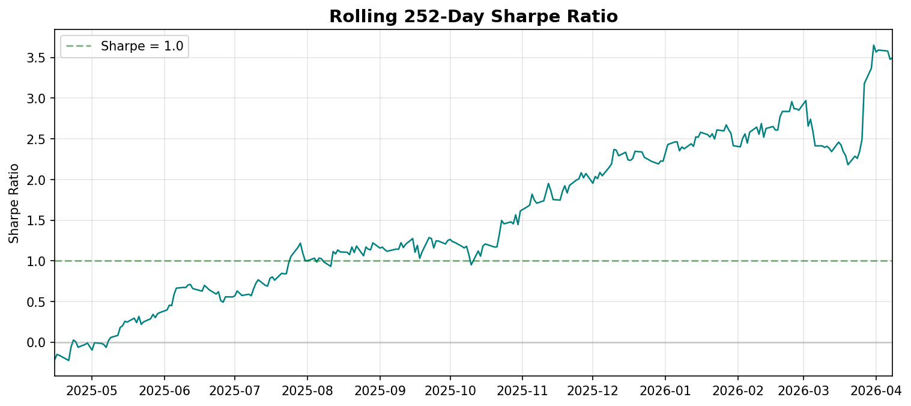
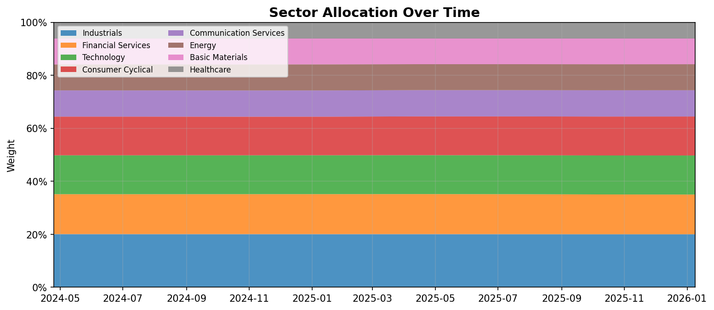
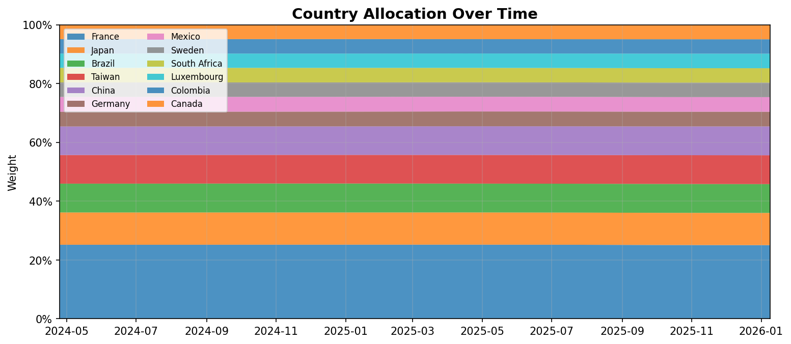
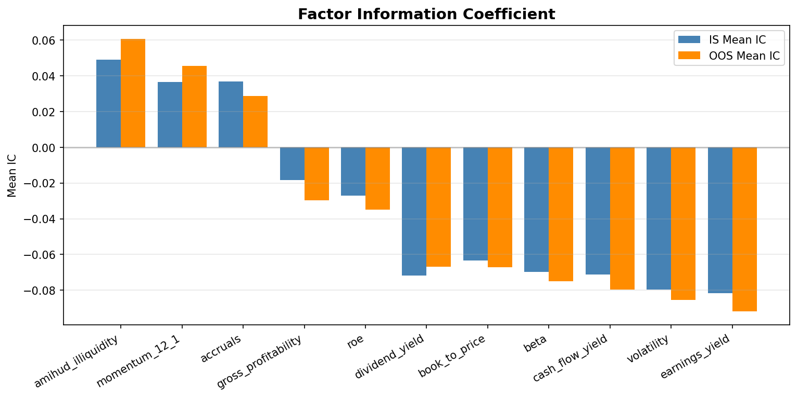

# Research Run Report

**Assembly hash:** `8c8f4e4e53d161f9`

## 1. Regime & Tilts

**Current regime:** `expansion`

| Factor | Tilt |
| --- | ---: |
| FactorGroupType.VALUE | 1.1739 |
| FactorGroupType.PROFITABILITY | 0.9783 |
| FactorGroupType.INVESTMENT | 0.9783 |
| FactorGroupType.MOMENTUM | 1.1739 |
| FactorGroupType.LOW_RISK | 0.7826 |
| FactorGroupType.LIQUIDITY | 0.9783 |
| FactorGroupType.DIVIDEND | 0.9783 |
| FactorGroupType.SENTIMENT | 0.9783 |
| FactorGroupType.OWNERSHIP | 0.9783 |

## 2. Factor IS / OOS IC

| Factor | IS Mean IC | IS t-stat | IS Significant | OOS Mean IC |
| --- | ---: | ---: | :---: | ---: |
| book_to_price | -0.0635 | -6.25 | yes | -0.0671 |
| earnings_yield | -0.0818 | -5.83 | yes | -0.0918 |
| cash_flow_yield | -0.0711 | -5.09 | yes | -0.0797 |
| gross_profitability | -0.0184 | -1.79 | yes | -0.0296 |
| roe | -0.0270 | -2.86 | yes | -0.0348 |
| accruals | 0.0369 | 2.57 | yes | 0.0288 |
| momentum_12_1 | 0.0365 | 2.11 | yes | 0.0455 |
| volatility | -0.0797 | -3.01 | yes | -0.0853 |
| beta | -0.0698 | -2.24 | yes | -0.0750 |
| amihud_illiquidity | 0.0490 | 3.72 | yes | 0.0607 |
| dividend_yield | -0.0718 | -3.43 | yes | -0.0668 |

## 3. Optimizer Config Diff vs Default

_No deviations from defaults._

## 4. Binding Constraints

_None._

## 5. Top-4 Retighten Trace

_No retighten attempts (Top-4 below threshold on first fit)._

## 6. Hybrid Rebalance Decision

- **Rebalance:** no
- **Reason:** `cold_start`

## 7. 17-Rule Checklist

| # | Rule | Pass | Measured | Target |
| ---: | --- | :---: | --- | --- |
| 1 | No single region > 60% | yes | `40.0%` | `≤ 60%` |
| 2 | No sector > regime cap | yes | `20.0% (Industrials)` | `all sectors ≤ regime cap` |
| 3 | HHI < 0.12 | yes | `0.0501` | `< 0.12` |
| 4 | Top-4 holdings < 30% | yes | `21.1%` | `< 30%` |
| 5 | Health Care exposure ≥ regime floor | yes | `6.0%` | `≥ 6%` |
| 6 | Information Technology exposure ≥ regime floor | yes | `14.7%` | `≥ 10%` |
| 7 | At least 8/11 sectors present | yes | `8/11 (Consumer Defensive, Utilities, Real Estate)` | `≥ 8/11` |
| 8 | Single-stock cap ≤ 10% | yes | `6.0%` | `≤ 10%` |
| 9 | Min position ≥ 2% | yes | `4.8%` | `≥ 2%` |
| 10 | Max drawdown > -22% | yes | `-14.4%` | `> -22%` |
| 11 | Vol ≤ benchmark vol | yes | `14.7% vs 16.8%` | `≤ benchmark` |
| 12 | Sharpe ∈ (1.0, 2.0) | yes | `1.466` | `∈ (1.0, 2.0)` |
| 13 | Sortino > 1.5 | yes | `1.919` | `> 1.5` |
| 14 | Info Ratio > 0.5 | no | `0.260` | `> 0.5` |
| 15 | Downside vol < 75% x total vol | no | `11.3% vs 75% x 14.7% = 11.0%` | `< 75% total` |
| 16 | Total cost ≤ 100 bps | yes | `25.5 bps` | `≤ 100 bps` |
| 17 | OOS span ≥ 1.5 years | yes | `1.95 yrs` | `≥ 1.5 yrs` |

## 8. Metrics

### Portfolio (gross)

| KPI | Value |
| --- | ---: |
| Ann. Return | 0.2177 |
| Ann. Vol | 0.1473 |
| Sharpe (rf) | 1.4763 |
| Sortino | 1.9319 |
| Info Ratio | 0.2662 |
| Downside Vol | 0.1126 |
| Max Drawdown | -0.1438 |

### Portfolio

| KPI | Value |
| --- | ---: |
| Ann. Return | 0.2174 |
| Ann. Vol | 0.1473 |
| Sharpe (rf) | 1.4741 |
| Sortino | 1.9294 |
| Info Ratio | 0.2661 |
| Downside Vol | 0.1125 |
| Max Drawdown | -0.1438 |

### Portfolio (after-tax)

| KPI | Value |
| --- | ---: |
| Ann. Return | 0.2162 |
| Ann. Vol | 0.1473 |
| Sharpe (rf) | 1.4661 |
| Sortino | 1.9188 |
| Info Ratio | 0.2596 |
| Downside Vol | 0.1126 |
| Max Drawdown | -0.1438 |

### SPY (benchmark)

| KPI | Value |
| --- | ---: |
| Ann. Return | 0.1640 |
| Ann. Vol | 0.1676 |
| Sharpe (rf) | 0.9774 |
| Sortino | 1.2447 |
| Info Ratio | 0.0000 |
| Downside Vol | 0.1316 |
| Max Drawdown | -0.1876 |

## 9. Charts

- 
- 
- 
- 
- 
- 

